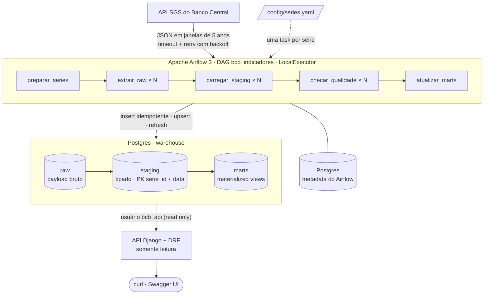
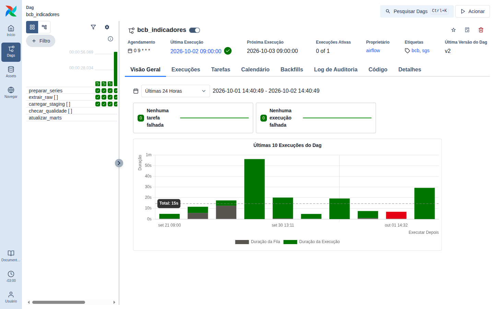
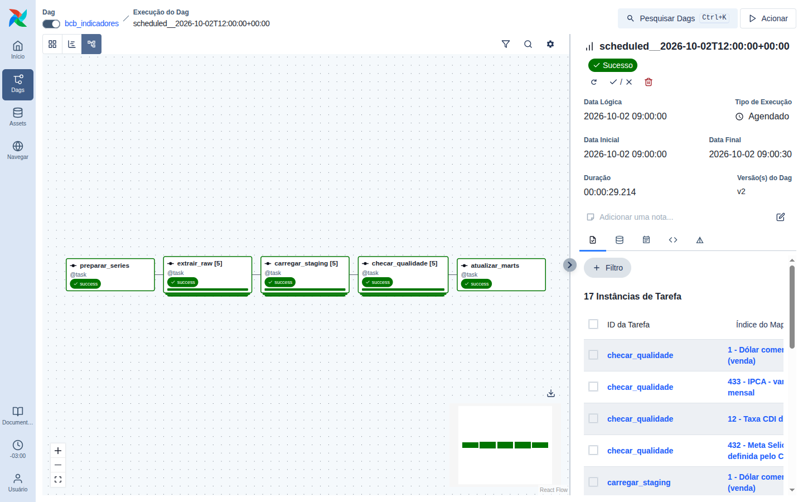
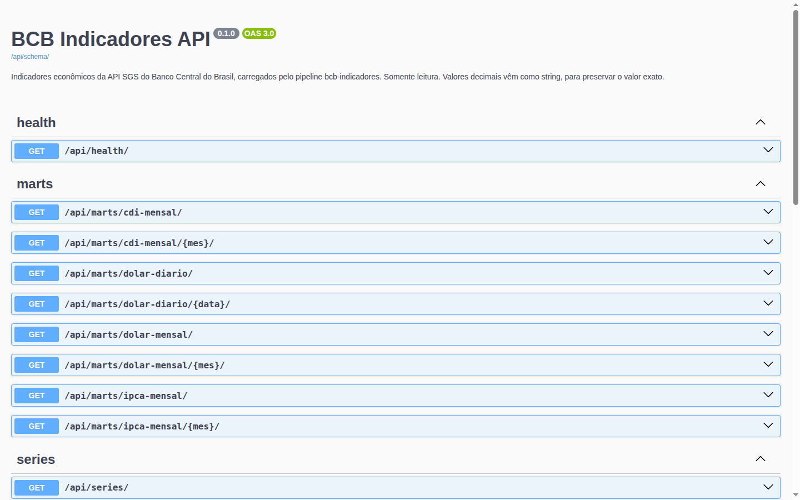
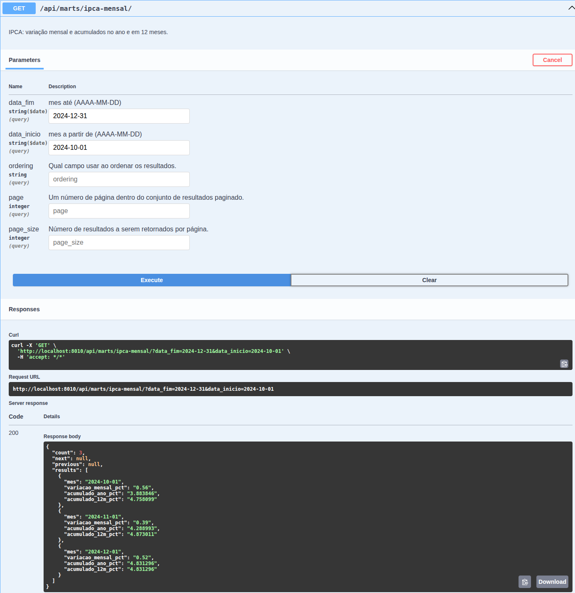

# bcb-indicadores-pipeline

[](https://github.com/BigLeno/bcb-indicadores-pipeline/actions/workflows/ci.yml)


Pipeline de dados que ingere séries econômicas da **API pública SGS do Banco Central do
Brasil**, organiza os dados em camadas no PostgreSQL e os expõe numa **API REST** documentada.
O escopo é pequeno de propósito, e o foco está no que torna um pipeline confiável em
produção: idempotência, carga incremental, backfill, qualidade de dados, observabilidade e
testes contra um banco real.

## O problema

Selic, CDI, IPCA e dólar estão no SGS do BCB, mas consumir a API diretamente é trabalhoso:

- **Paginação obrigatória:** séries diárias aceitam no máximo 10 anos por consulta, e com
  datas obrigatórias.
- **Respostas inconsistentes:** uma janela sem dados volta como erro, e não como lista vazia;
  uma falha no gateway volta como **HTTP 200 com uma página HTML**.
- **Cálculo a cargo de quem consome:** a API entrega a série crua. Para ter o IPCA acumulado
  em 12 meses ou o CDI do mês, é preciso compor as taxas.

Este projeto resolve isso uma vez só: busca, guarda o bruto, tipa, valida, calcula os
indicadores e serve o resultado com filtros, paginação e OpenAPI.

## Arquitetura



Os detalhes, com o fluxo de uma execução e o modelo de dados, estão em
[docs/arquitetura.md](docs/arquitetura.md).

| Camada | O que guarda | Para quê |
|---|---|---|
| `raw.sgs_payload` | JSON de cada consulta, como veio, com série, janela, sha256 e `run_id` | auditoria e reprocessamento sem chamar a API de novo |
| `staging.serie_valor` | `(serie_id, data, valor numeric)`, com PK na dupla | fonte única tipada; alvo do upsert |
| `marts.*` | IPCA acumulado (ano e 12 meses), CDI no mês, dólar diário e mensal | consumo direto pela API |

**Séries iniciais** (configuráveis em [`config/series.yaml`](config/series.yaml)):

| Código | Série |
|---|---|
| 11 | Selic diária |
| 432 | Meta Selic |
| 12 | CDI diário |
| 433 | IPCA mensal |
| 1 | Dólar comercial (venda) |

## Como rodar

Requisitos: Docker com Compose v2, `make` e `openssl`.

```bash
git clone https://github.com/BigLeno/bcb-indicadores-pipeline.git && cd bcb-indicadores-pipeline
make up        # gera o .env com segredos aleatórios, sobe tudo e espera ficar saudável
make trigger   # despausa a DAG; a primeira execução faz a carga histórica desde 2000
```

Em cerca de um minuto, os dados estão disponíveis:

- **UI do Airflow:** <http://localhost:8080>. O usuário é `admin`, e a senha está em
  `AIRFLOW_ADMIN_PASSWORD` no `.env`.
- **API:** <http://localhost:8000/api/>, com o Swagger em <http://localhost:8000/api/docs/>.

```bash
curl "http://localhost:8000/api/marts/ipca-mensal/?data_inicio=2024-10-01&data_fim=2024-12-31"
```

```json
{
  "count": 3,
  "next": null,
  "previous": null,
  "results": [
    {"mes": "2024-10-01", "variacao_mensal_pct": "0.56", "acumulado_ano_pct": "3.883846", "acumulado_12m_pct": "4.758099"},
    {"mes": "2024-11-01", "variacao_mensal_pct": "0.39", "acumulado_ano_pct": "4.288993", "acumulado_12m_pct": "4.873011"},
    {"mes": "2024-12-01", "variacao_mensal_pct": "0.52", "acumulado_ano_pct": "4.831296", "acumulado_12m_pct": "4.831296"}
  ]
}
```

O valor de dezembro, **4,83%**, é o IPCA oficial de 2024. Os marts foram conferidos com os
números publicados.

<details>
<summary>Todos os comandos do Makefile</summary>

| Comando | O que faz |
|---|---|
| `make up` / `make down` | sobe ou para a stack (`down` mantém os dados) |
| `make clean` | para tudo e **apaga os volumes** |
| `make trigger` | despausa a DAG e dispara uma execução |
| `make backfill FROM=2024-01-01 TO=2024-01-31` | reprocessa um período (`TO` inclusivo), executado pelo scheduler |
| `make test` | testes do pipeline (unitários + integração) e da API |
| `make test-pipeline ARGS="-m 'not integration'"` | só os testes unitários do pipeline |
| `make lint` / `make format` | ruff |
| `make migrate` | aplica as migrations pendentes |
| `make psql` | abre um `psql` no warehouse |
| `make logs S=airflow-scheduler` | acompanha os logs de um serviço |

</details>

## Prints

**DAG no Airflow.** A execução vermelha é proposital: a demonstração de uma checagem de
qualidade reprovando uma série e impedindo a atualização dos marts.



**Grafo de uma execução.** Cada etapa mapeada roda uma instância por série (`[5]`), nomeada
pelo código e pelo nome da série.



**API: documentação OpenAPI** (Swagger UI em `/api/docs/`).



<details>
<summary>Uma chamada real pelo Swagger ("Try it out")</summary>



</details>

## Decisões técnicas e trade-offs

### Por que camadas (raw → staging → marts)

- **O raw é a garantia de reprocessamento.** Guardar a resposta original permite refazer o
  staging (por uma regra de parsing nova, por exemplo) sem bater na API, que é lenta e
  instável.
- **Cada camada tem um contrato próprio.** O staging garante tipo e unicidade, e o mart
  garante a regra de negócio. Um erro no cálculo de um mart não contamina os dados de base.
- **Custo:** o dado é armazenado duas ou três vezes. A este volume (cerca de 30 mil linhas),
  é irrelevante.

### Por que upsert (`INSERT ... ON CONFLICT`)

- **Rodar de novo é seguro.** Retry do Airflow, backfill e reexecução manual não duplicam
  nada, porque a PK `(serie_id, data)` é o alvo do upsert.
- **Só muda o que mudou.** O `DO UPDATE ... WHERE valor IS DISTINCT FROM EXCLUDED.valor` só
  reescreve a linha se o valor mudou. Assim, `atualizado_em` marca **revisões reais do BCB**,
  e o log separa inseridas, atualizadas e inalteradas.
- **O raw também é idempotente.** Ele é único por `(série, janela, sha256 do payload)`: a
  mesma resposta não é gravada duas vezes, mas uma resposta diferente para a mesma janela
  (uma revisão) fica no histórico.
- **Alternativa descartada:** truncate e recarga, mais simples, mas que perde o histórico de
  revisões, deixa a tabela vazia durante a carga e obriga a buscar tudo de novo.

### Por que dynamic task mapping

- **Adicionar uma série é editar o YAML**, sem tocar no código: `extrair_raw.expand(...)`
  cria uma instância por série em tempo de execução.
- **Isolamento:** cada série tem seu próprio retry, log e estado na UI. A instabilidade numa
  série não derruba as outras, e uma série que falha não refaz o trabalho das que passaram.
- **Paralelismo controlado:** `max_active_tis_per_dagrun=3` limita a três as consultas
  simultâneas à API pública.
- **Alternativa descartada:** uma task fazendo um laço sobre as séries, que perde o
  isolamento e a visibilidade.

### Outras decisões

| Decisão | Por quê | Trade-off |
|---|---|---|
| **Incremental pela última data carregada (inclusive)** em vez de pela data da run | se recupera sozinho de dias perdidos e pega revisões do último ponto | sempre rebusca um dia, coberto pelo upsert |
| **`catchup=False`** e carga histórica pela lógica incremental | uma run carrega 26 anos (cerca de 1 min) em vez de criar milhares de runs | o backfill fica explícito (`make backfill`) |
| **Retry em duas camadas:** client (4 tentativas, backoff exponencial com jitter, respeita `Retry-After`) e Airflow (3 retries, backoff de até 15 min) | falhas curtas se resolvem dentro da task; indisponibilidades longas, entre tentativas | o pior caso de espera é maior |
| **Checagem de qualidade após o staging, bloqueando os marts** | dado ruim não chega a quem consome; a falha diz qual regra e traz uma amostra | o staging pode ter o dado ruim até alguém corrigir |
| **Marts como materialized views + `REFRESH CONCURRENTLY`** | definição versionada, troca atômica, leitura sem bloqueio | mudar a regra exige uma migration nova |
| **Migrations em SQL puro numerado** (executor de cerca de 100 linhas, com checksum e advisory lock) em vez de Alembic | o pipeline não usa ORM, e SQL é legível na revisão | não há *downgrade*: as mudanças só andam para frente |
| **LocalExecutor** em vez de Celery | 5 séries não justificam Redis e workers | escalar exige trocar o executor (uma variável) |
| **Dois Postgres** (metadata do Airflow e warehouse) | ciclo de vida, credenciais e volumes independentes | um container a mais |
| **Lógica em `src/bcb_pipeline/`, sem importar o Airflow** | testável sem Airflow; a DAG só orquestra | uma camada a mais entre a DAG e o código |
| **API com usuário próprio só de leitura** (`default_transaction_read_only`) | a API não consegue escrever nem ler o `raw`, mesmo com um bug | o provisionamento fica no passo de migração |
| **Decimais como string** na API (`"0.043739"`) | float do JSON perderia precisão | quem consome converte |
| **Django 5.2 LTS** em vez do 6.1 | é a versão que DRF, drf-spectacular e pytest-django suportam juntos; suporte até 2028 | sem os recursos do 6.x |

### O que a API do BCB faz de verdade

Medido em setembro de 2026, durante o desenvolvimento. Cada item tem tratamento no
[client](src/bcb_pipeline/sgs_client.py) e um teste.

- **Limite de janela e datas obrigatórias:** séries diárias sem `dataInicial`/`dataFinal`,
  ou com mais de 10 anos, voltam **HTTP 406**.
- **Lentidão perto do corte:** uma janela de 10 anos de série diária leva cerca de 20 s, e o
  gateway corta perto de 30 s. Por isso as janelas são de **5 anos**, o que dá folga.
- **Janela vazia:** volta `{"erro": ... "Value(s) not found"}`, às vezes com 404 e às vezes
  com 200. É tratada como "sem dados".
- **Erro do gateway:** a mesma página HTML ("Requisição inválida") aparece com 200 ou 502,
  tanto para timeout quanto para série inexistente. Como não dá para distinguir os casos, a
  página é tratada como erro transitório; se persistir, a mensagem sugere conferir o código
  da série.
- **Cache de "sem dados":** o BCB parece guardar em cache o "sem dados" de antes da
  publicação. A carga incremental absorve isso, porque a URL muda todo dia.

## Qualidade e testes

- **Checagens por série após o staging:** série sem dados, valores nulos, datas futuras,
  datas duplicadas e valor fora da faixa plausível (definida no YAML). A falha em qualquer uma
  falha a task, sem retry.
- **109 testes**, todos no CI:
  - **66 unitários do pipeline**, com a API do BCB simulada por `httpx.MockTransport`
    (sem rede);
  - **25 de integração do pipeline em Postgres real.** Cada sessão cria um banco descartável,
    aplica as migrations reais e o apaga no fim. Cobrem loader, marts com valores calculados
    à mão, permissões do usuário da API e um teste de ponta a ponta mostrando que a segunda
    execução não duplica nada;
  - **18 da API**, contra o schema real do warehouse.
- **CI** ([`.github/workflows/ci.yml`](.github/workflows/ci.yml)) com três jobs: pre-commit
  (ruff, YAML, TOML, chaves privadas) e `docker compose config`; pipeline com `postgres:17`
  de serviço e a versão do Airflow lida do `Dockerfile`; e API.
- **Logs estruturados em JSON.** Cada etapa registra contagens: registros lidos, payloads
  novos, linhas inseridas, atualizadas, inalteradas e descartadas, e o resultado de cada
  checagem.

## Estrutura

```
bcb-indicadores-pipeline/
├── dags/bcb_indicadores.py      # só orquestração (TaskFlow + dynamic task mapping)
├── src/bcb_pipeline/            # client da API, transformações, loaders, qualidade, marts
├── sql/migrations/              # schema versionado (001 a 005)
├── config/series.yaml           # séries, carga inicial e faixas de qualidade
├── tests/                       # unit/ (sem rede) e integration/ (Postgres real)
├── api/                         # Django + DRF + drf-spectacular (imagem própria)
├── docs/                        # arquitetura (Mermaid) e prints
├── docker-compose.yml           # Airflow, 2 Postgres, migrate, API
├── Makefile
└── .github/workflows/ci.yml
```

## Próximos passos

- **Alertas:** avisar quando uma checagem de qualidade falhar ou uma série ficar sem dados
  novos além do esperado (callback do Airflow para Slack ou e-mail, mais uma checagem de
  frescor por série).
- **Lock de dependências** (por exemplo, `uv.lock`) e build das imagens no CI, com publicação
  no GHCR.
- **Runner fixo no CI** (`ubuntu-24.04`): o `ubuntu-latest` muda de versão em outubro de 2026.
- **API:** cache HTTP (`ETag`/`Cache-Control`), já que os dados mudam uma vez por dia, e um
  limite de requisições compartilhado entre os workers (Redis), em vez de um por processo.
- **Mais indicadores:** IGP-M, PIB mensal e juro real (Selic menos IPCA em 12 meses) como
  mart.
- **Deploy** em nuvem com o Postgres gerenciado e o Airflow em Kubernetes ou num serviço
  gerenciado.
