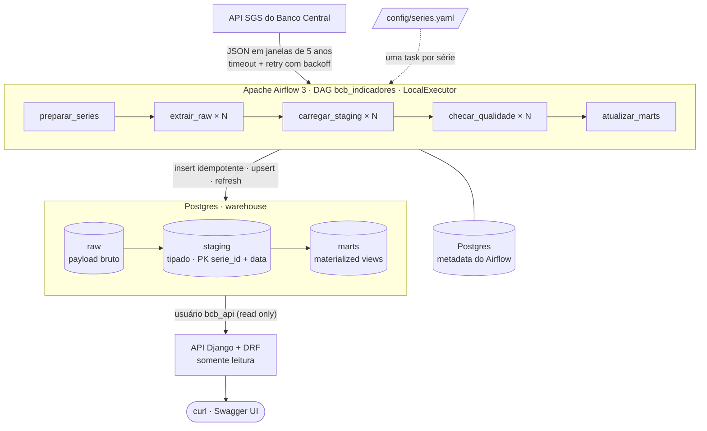
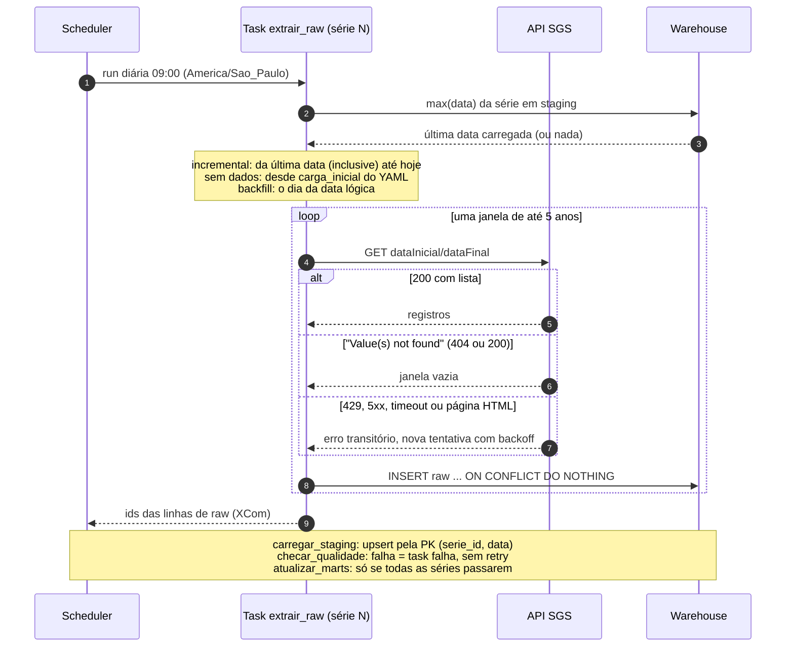
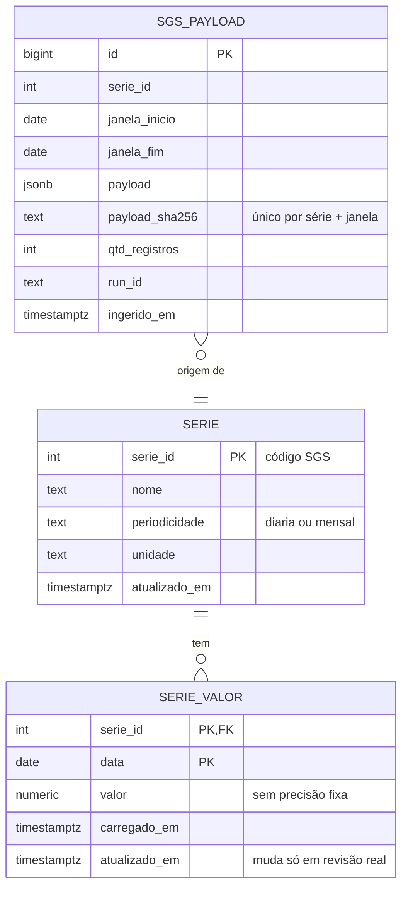

# Arquitetura

## Componentes

| Task | Lê | Escreve |
|---|---|---|
| `preparar_series` | `config/series.yaml` | `staging.serie` (catálogo) |
| `extrair_raw` × N | API SGS | `raw.sgs_payload` (`ON CONFLICT DO NOTHING`, dedup por sha256) |
| `carregar_staging` × N | `raw.sgs_payload` | `staging.serie_valor` (upsert pela PK) |
| `checar_qualidade` × N | `staging.serie_valor` | nada; falha a task se houver violação |
| `atualizar_marts` | `staging.serie_valor` | `marts.*` (`REFRESH MATERIALIZED VIEW CONCURRENTLY`) |

- Dois Postgres separados: o metadata do Airflow e o warehouse têm credenciais, volumes
  e ciclos de vida independentes.
- Toda a lógica fica em `src/bcb_pipeline/`, sem dependência do Airflow. A DAG
  (`dags/bcb_indicadores.py`) só orquestra.
- A API conecta com um usuário que só tem `SELECT` em `marts` e `staging` (sem acesso a
  `raw`) e com `default_transaction_read_only = on`.

## Uma execução da DAG

## Modelo de dados

Os marts são materialized views sobre `staging.serie_valor`, cada uma com um índice
único, que é o requisito do `REFRESH CONCURRENTLY`:

| Mart | Chave | Conteúdo |
|---|---|---|
| `marts.ipca_mensal` | `mes` | variação mensal, acumulado no ano e em 12 meses (só com 12 meses consecutivos) |
| `marts.cdi_mensal` | `mes` | CDI composto no mês, dias úteis e última data (o mês corrente é parcial) |
| `marts.dolar_diario` | `data` | cotação de venda e variação sobre o dia útil anterior |
| `marts.dolar_mensal` | `mes` | fechamento (último dia útil) e variação sobre o mês anterior |

O acumulado de taxas é `prod(1 + r/100) - 1`, calculado como `exp(sum(ln(1 + r/100))) - 1`,
porque o Postgres não tem agregado de produto. Os resultados foram conferidos com os números
oficiais: IPCA de 4,62% em 2023 e 4,83% em 2024, e CDI de 0,97% em janeiro de 2024.
